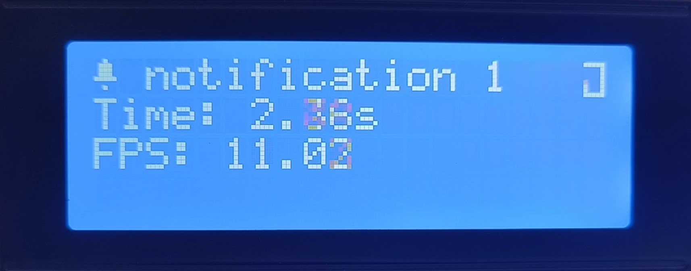
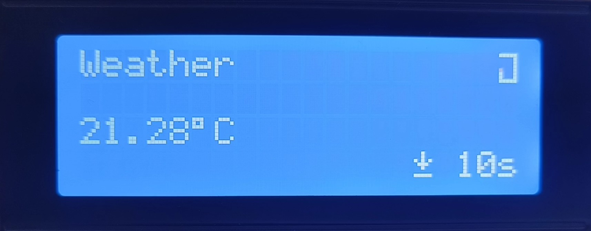
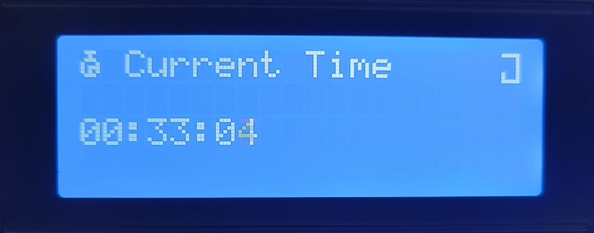
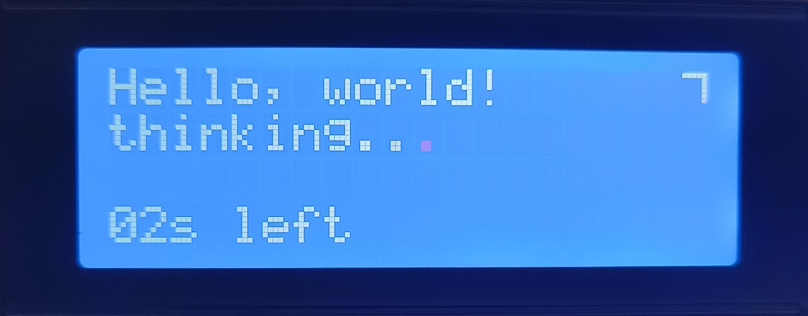
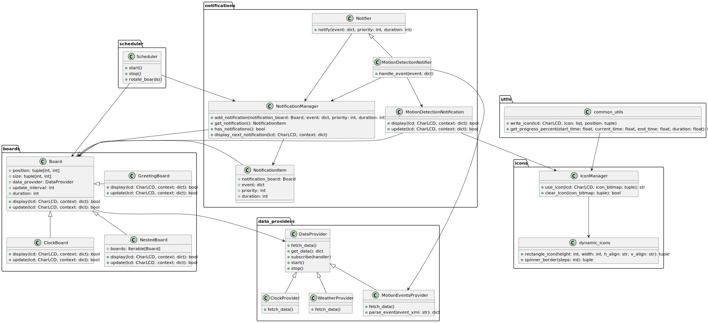

# Lcdash

I wanted a simple way to monitor my server stats and view other information at a glance.
I bought a 20x4 LCD specifically for this purpose and connected it to my Raspberry Pi to display the information.

Lcdash is a simple dashboard for dot matrix LCD displays. It is designed to be used with the 20x4 LCDs though it can be easily adapted to work with other size displays. It is written in Python and uses the [RPLCD](https://github.com/dbrgn/RPLCD) library to interface with the LCD.





Few boards that I use. Top right corner shows the current board progress.

## Features

- Dynamic icons that can be used for animations.
- Cycle through boards using a configurable scheduler.
- Notification system for displaying prioritizable messages, interrupting the normal board cycle.
- Background data fetching for boards that need to update their data periodically.
- Icon management using the 8 custom characters available on the LCD.
- Progress indicator showing the current board cycle progress.

## Usage

Lcdash uses the concept of "boards" to display information on the LCD. Each board is responsible for rendering its own content on a specific area of the LCD. Boards can be nested to create complex layouts.

Lcdash is designed to be easily extensible. You can create your own boards by subclassing the `Board` class and implementing the `display` and `update` methods. You can then add your board to the scheduler to have it displayed on the LCD.

Check out [main.py](main.py) to see how to create and schedule boards.

1. **Environment setup**:
    - Install the required dependencies:
        ```bash
        # venv
        pip install -r requirements.txt

        # conda
        conda env create -f environment.yml
        ```
    - Copy the `sample.env` file to `.env` and configure it with your settings.

2. **Adding boards**:
    - Subclass the `Board` class in the `boards` directory and implement the `display` and `update` methods.
    - Add your board to a list of boards to pass to the `Scheduler` class.
    ```python
    from boards.clock_board import ClockBoard
    from boards.nested_board import NestedBoard
    from components.progress_bar import ProgressSpinner

    time_board = (
        ClockBoard(data_provider=clock_provider, size=(4, 19)),
        ProgressSpinner(size=(4, 1), position=(0, 19)),
    )
    board_list = (
        NestedBoard(boards=time_board, duration=10),
    )
    ```

3. **Adding data providers (optional)**:
    - Subclass the `DataProvider` class in the `data_providers` directory and implement the `fetch` method.
    - Add your data provider to the board that needs it.
    ```python
    # data_providers/clock.py
    from data_providers.base_provider import DataProvider
    class ClockProvider(DataProvider):
        def fetch(self):
            self.set_data({"time": datetime.now().strftime("%H:%M:%S")})
    
    # main.py
    from data_providers.clock import ClockProvider

    clock_provider = ClockProvider(update_interval=1)  # create the provider object
    clock_provider.start()  # start the provider fetch loop
    ```

4. **Adding notifications (optional)**:
    - Subclass the notifier class in the `notifiers` directory and implement the `notify` method.
    - set the notification_board attribute to the board that should be displayed when the notification is triggered.
    ```python
    from notifications.notifier import Notifier
    from notifications.manager import NotificationManager

    notification_manager = NotificationManager()
    motion_notifier = MotionDetectionNotifier(
        notification_manager,  # Notification manager
        motion_board, # Board to display when notification is triggered
        motion_provider, # Optional data provider that triggers the notifier on data change
    )
    ```

5. **Custom icons**:
    - Create custom icons using 8x5 bitmaps and add them to the `icons.py` file.
    - For dynamic icons, create a function in the `dynamic_icons.py` file that returns the icon based on the current state.
    - To use the icon, import the `IconManager` class and call the `use_icon` method with the icon name.
    ```python
    from icons.manager import IconManager
    import icons.icons as icons

    text = "Downloading" + IconManager.use_icon(lcd, icons.DOWNLOAD)
    lcd.write_string(text)
    ```

6. **Scheduling**:
    - To start the board cycle, simply create a `Scheduler` object and call the `start` method.
    ```python
    from scheduler.scheduler import Scheduler

    scheduler = Scheduler(lcd, boards, notification_manager)
    scheduler.start()
    scheduler.stop() # To stop the scheduler
    ```

## Architecture

The following diagram shows the architecture of the project:



## Contributing

Contributions are welcome. Feel free to open an issue or submit a pull request.

## Future improvements

- Add multipage boards to display more information.
- Add simple graphs to display historical data.
- News, Quotes, and other information boards.
- Improve progress indicator showing the current board cycle progress.

## License

This project is licensed under the MIT License - see the [LICENSE](LICENSE) file for details.

## Contact

If you have any questions or suggestions, feel free to create an issue or contact me at mail@ayushmanmuduli.com.
